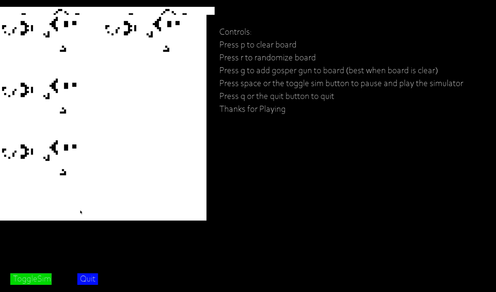

# Conway
Very primitive implementation of Conway's Game of Life rules.
Currently only made for a 1920x1080 screen setup. Will automatically go fullscreen on start/

Video of game in action

https://www.youtube.com/watch?v=TisIK1soQSk

#Controls
-Start sim - Space

-Place random cells - R

-Erase board - P

-Place gosper gliders on screen (use with blank board) - G

-Quit game - Q

